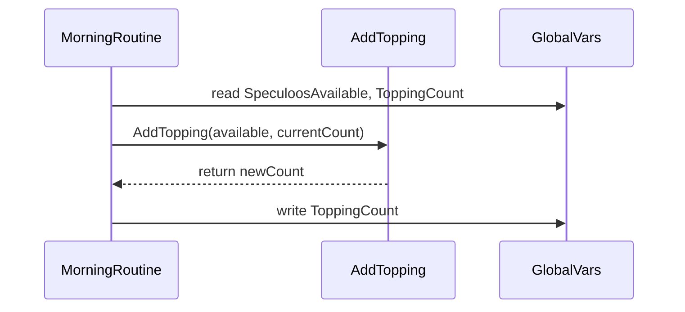

**Function Call Sequence Diagram**

```mermaid
sequenceDiagram
    participant Task as MorningRoutine
    participant Func as AddTopping
    participant GVL as GlobalVars

    Task->>GVL: read SpeculoosAvailable, ToppingCount
    Task->>Func: AddTopping(available, currentCount)
    Func-->>Task: return newCount
    Task->>GVL: write ToppingCount

```

Notes: Shows the call and return for `AddTopping` and the variable updates in `GVL`.
