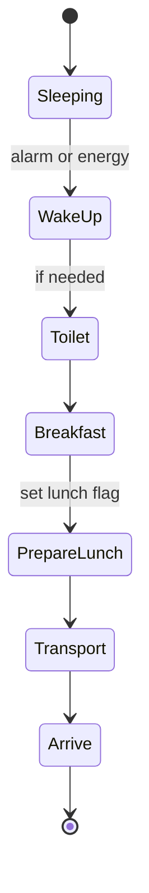

**Task 1 State Diagram**

```mermaid
stateDiagram-v2
    [*] --> Sleeping
    Sleeping --> WakeUp : alarm or energy
    WakeUp --> Toilet : if needed
    Toilet --> Breakfast
    Breakfast --> PrepareLunch : set lunch flag
    PrepareLunch --> Transport
    Transport --> Arrive
    Arrive --> [*]
```

Notes: `MorningRoutine` implements these states and reads/writes GVL variables.
