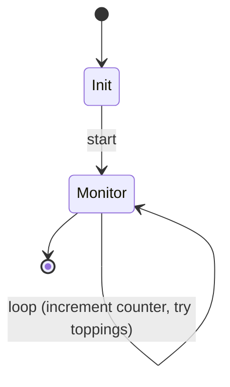

**Task 2 State Diagram**

```mermaid
stateDiagram-v2
    [*] --> Init
    Init --> Monitor : start
    Monitor --> Monitor : loop (increment counter, try toppings)
    Monitor --> [*]
```

Notes: `MonitorRoutine` continuously updates `GVL.Global_SharedCounter` and may call `AddTopping`.
