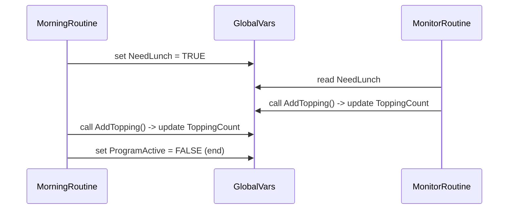

**Tasks Communication Sequence Diagram**

```mermaid
sequenceDiagram
    participant T1 as MorningRoutine
    participant GVL as GlobalVars
    participant T2 as MonitorRoutine

    T1->>GVL: set NeedLunch = TRUE
    T2->>GVL: read NeedLunch
    T2->>GVL: call AddTopping() -> update ToppingCount
    T1->>GVL: call AddTopping() -> update ToppingCount
    T1->>GVL: set ProgramActive = FALSE (end)

```

Notes: The diagram shows how both tasks read/write the `GVL` and how the function is used by both.
